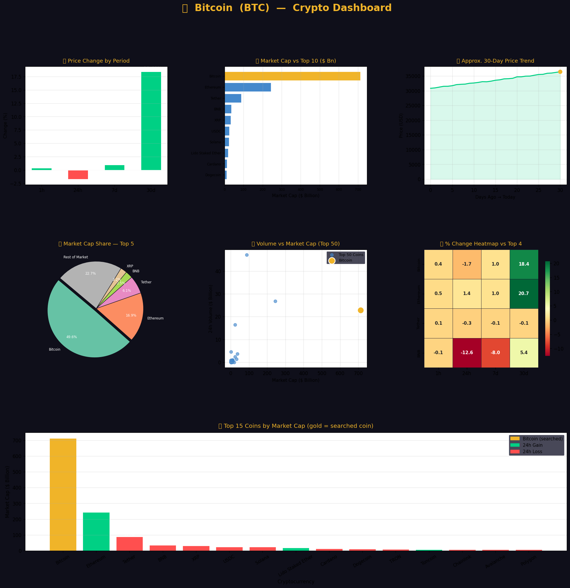

#  Cryptocurrency Data Explorer

A college project I built for my Data Science course. The idea was simple — instead of just doing basic analysis on a dataset, I wanted to make something actually interactive where you can type in any crypto name and get everything about it at once, numbers + charts.

---

## What it does

You run the notebook, type in a coin name like `Bitcoin` or just the ticker `BTC`, and it will show you:

- Current price, market cap, 24h volume, circulating supply
- Price change across 1h / 24h / 7d / 30d
- A 7-panel visual dashboard for that specific coin
- How the coin compares against the rest of the dataset
- Vol/MCap ratio ( a liquidity indicator)

There are also 4 standalone charts that visualize the whole 1000-coin dataset regardless of what you search — market cap share, volume distribution, gainers vs losers sentiment, and a tier breakdown.

---

## The dataset

`Crypto_CurrencyData.csv` — top 1000 cryptocurrencies scraped from CoinMarketCap. Has rank, price, % changes, volume, supply, and market cap for each coin.

The data was pretty messy when I got it. Prices had dollar signs and commas (`"$36,456.94"`), percentage columns had `%` symbols stored as strings, some supply values were literally written as `"88.3 Billion"` instead of a number, and there were a bunch of `$-` values for coins with no price data. Cleaning this took longer than I expected honestly.

---

## Project Structure

```
CRYPTO_CURRENCY/
│
├── Data_Sets/
│   └── Crypto_CurrencyData.csv
│
├── Crypto_Currency.ipynb       ← main notebook
├── requirements.txt
└── README.md
```

---

## How to run it

**1. Clone or download the repo**

**2. Create a virtual environment (optional but recommended)**
```bash
python -m venv venv
venv\Scripts\activate        # Windows


**3. Install dependencies**
```bash
pip install -r requirements.txt
```

**4. Open the notebook**
```bash
jupyter notebook Crypto_Currency.ipynb
```
Or just open it directly in VS Code with the Jupyter extension.

**5. Run all cells top to bottom** — this part matters, don't skip cells. The cleaning steps need to run in order before the search works.

**6. When you hit the search cell, type any coin:**
```
🔍 Enter cryptocurrency name or symbol: Ethereum
🔍 Enter cryptocurrency name or symbol: SOL
🔍 Enter cryptocurrency name or symbol: Dogecoin
```

---

## Libraries used

| Library | What I used it for |
|---|---|
| `pandas` | Loading, cleaning, and slicing the data |
| `numpy` | Stats calculations, percentile ranking, filling nulls |
| `matplotlib` | All the charts — bars, pies, scatter, line trend |
| `seaborn` | The % change heatmap |
| `os` | Building the CSV path so it works on any machine |

---

## Dashboard preview




## Things I ran into

The biggest headache was the data cleaning. The `\S` vs `\s` regex mistake wiped all prices silently — `\S` matches non-whitespace characters so it deleted every digit. Took me a while to figure out why all my prices were NaN. Also had issues with cells running out of order causing `KeyError: 'vol_to_mcap'` — the column gets created in step 6 and if you skip it the search function crashes. Rule of thumb: always restart kernel and run all cells before testing.


## What I learned

Honestly the most useful thing wasn't the visualization part, it was the cleaning. Real datasets are never clean. Every column had a different type of mess — currency formatting, percentage symbols, mixed string/numeric types, infinity symbols (`∞`) in supply columns. Learning how to handle all of that with pandas properly was the main takeaway for me.

